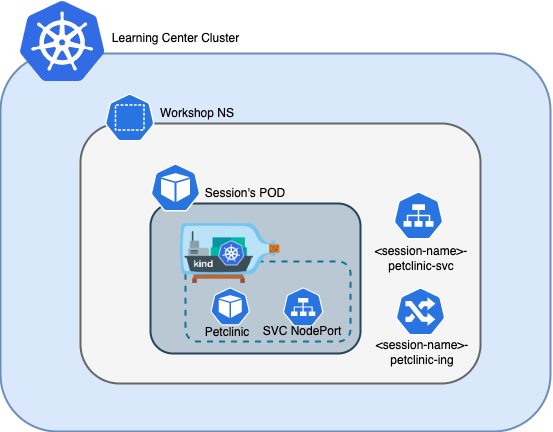

# TMC Module

This the second Module of the TKO Workshop. This Module includes an **automated** Kind Cluster installation for executing all TMC exercises covered in this module. 

https://workshop.tko.mytanzusandbox.com/

## Prerequisites

* A Kubernetes Cluster for TAP Learning Center installation with Worker Nodes of 8 vCPUs and 16 Gib RAM
* Learning Center operator up and running. For installation instructions for the Learning Center operator see: https://docs.vmware.com/en/Tanzu-Application-Platform/1.1/tap/GUID-learning-center-install-learning-center.html

## Module Architecture

This module utilizes a local [Kind](https://kind.sigs.k8s.io/) Cluster to run the module's tasks. The Kind Cluster will be deployed during the session's POD start as part of the [setup.d](./workshop/setup.d/) scripts.

Part of the [Workshop setup](./resources/workshop.yaml), it creates a service and an ingress to expose a [petclinic app](./petclinic-app/deployment.yaml) to the outside of the Kind Cluster.

 

