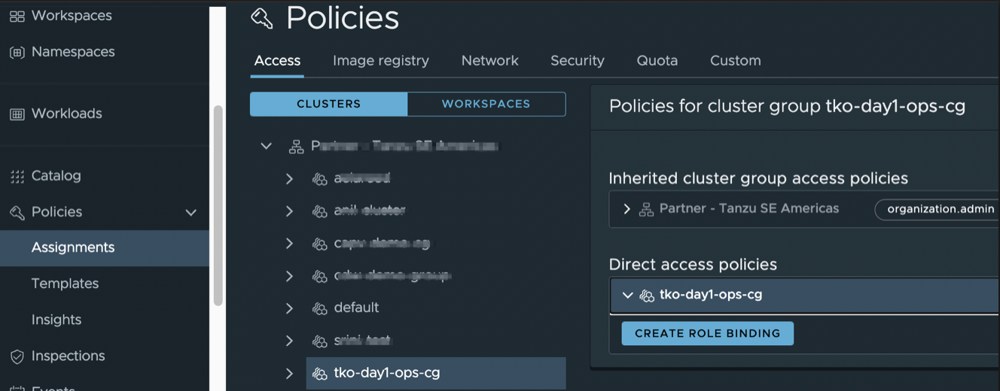
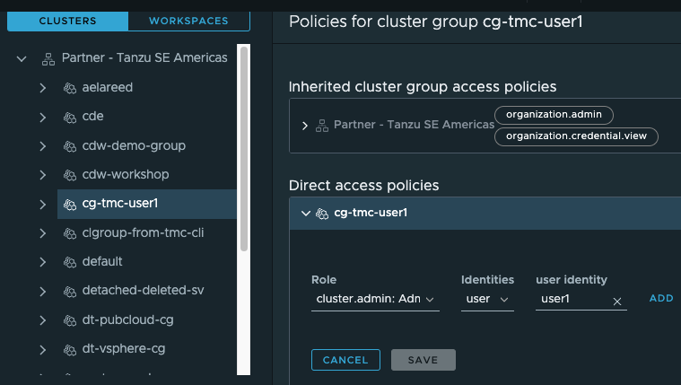
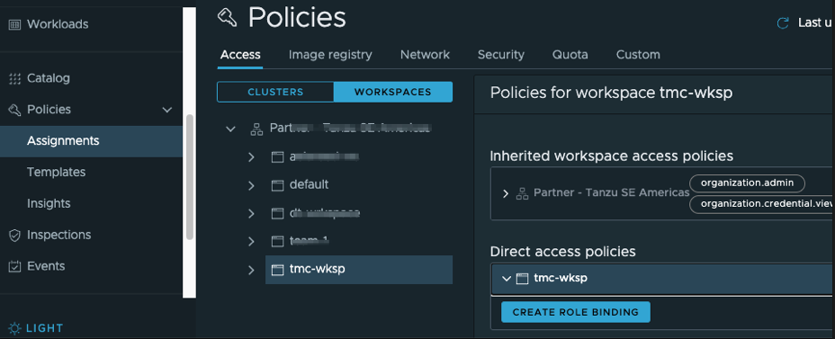
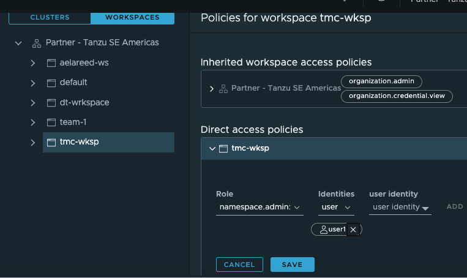

VMware Tanzu Mission Control uses secure-by-default, role-based access control (RBAC) to manage user permissions at each level of the hierarchical structure for your organization. Each object is protected by an access policy that defines who has access to that resource, and these policies are inherited down through the organizational hierarchy.

Access policies can be managed at three levels:

* organization level
* cluster group level 
* workspace level.

***Managing Users and Groups***

Before we start to look into how TMC can help you to use access policies to implement role-based access control (RBAC) for the users and resources in your organization. We need to understand how users and groups can be created and managed. For this purpose, you can use VMware Cloud Services Platform tools to invite users to your organization and organize them into user groups. 
By combining your users into groups, you can simplify access control by creating access policies that bind roles to groups rather than individuals. For more information about Identity & Access Management in VMware Cloud Services, see [Identity & Access Management](https://docs.vmware.com/en/VMware-Cloud-services/services/Using-VMware-Cloud-Services/GUID-D8316607-FE94-4DBA-9712-5CAD4DE885B5.html) in the Using VMware Cloud documentation.

You are not limited to create local users and groups in your VMWare Cloud Service Organization, you can also set up <ins>federation</ins> with your corporate domain that allows you to use your organization's single sign-on and identity source. For more information about federating identity management, see What is [enterprise federation and how does it work](https://docs.vmware.com/en/VMware-Cloud-services/services/setting-up-enterprise-federation-cloud-services/GUID-76FAECB3-CFAA-461E-B9C9-2A49C39CD17F.html) in the Using VMware Cloud Services Console documentation.

<ins>**Add local user**</ins> 

As an organization owner, you invite users to your organization and give them access to the services associated with it. You can also track the invitations you send. Invitations are valid for up to seven days. If you have sent an invitation in error, you can revoke it.


Below is an example of a user and a group


<ins>**About Roles in VMware Cloud Services Platform**</ins>

For services in the VMware Cloud Services platform, the organization provides two roles, owner and member. As an organization owner, you can specify the roles of members in your organization, both at the organizational level and at the service level. For the Tanzu Mission Control service, there are two service roles:

<ins>Service Admin</ins>

This role provides additional permissions for administrators of the service in your organization.

<ins>Service Member</ins>

This role provides typical service usage permissions for most members in your organization.


To grant a user or group an access privilege, click on Policies and then Assigments from the left pane, as shown below:


To edit the access policy for an object, you must be associated with the *.admin* role for that object.

<details>
  <summary><b><u>Access Policy at Organization Level</u></b></summary>
  <p>
  Access policies may be configured at the organization level either using TMC Console or TMC CLI . 
  </p>
    <details>
    <summary><b>TMC Console</b></summary>
    <p>

* Click on Access then the root organization in the left pane.
* In the organizational view on the Access tab of the Policies page, select the object whose access policy you want to add a role binding to.


- Click on the organization:  *Partner - Tanzu SE Americas*
- Click the arrow next to the object name *Partner - Tanzu SE Americas* under Direct access policies.
- Click Create Role Binding.
- Select the *cluster.admin* role to grant administrative access to this cluster group that you want to bind to an identity.
- Select the identity type (user or group) that you want to bind.
- Enter one or more identities, clicking Add after each identity, and then click Save.
    </p> 
    </details>
    <details>
    <summary><b>TMC CLI</b></summary>
    <p>
* Create a policy 

    ```execute-1
    tmc organization iam add-binding -r cluster.edit -u user01 
    ```
* Confirm that the policy has been created    

    ```execute-1
    tmc organization iam get-policy
    ```
* Delete the created policy 

    ```execute-1
    tmc organization iam remove-binding -r cluster.edit -u user01 
    ```    
    </p> 
    </details>

</details>


***Access Policy at Cluster Group Level***

Access policies may be configured at the cluster group level. Click on 
Access in the right pane and then Clusters.
In the organizational view on the Access tab of the Policies page, select the object whose access policy you want to add a role binding to.



- Click on the cluster group:  *tko-day1-ops-cg*. 
- Click the arrow next to the object name under Direct access policies.
- Click Create Role Binding.
- Select the *cluster.admin* role to grant administrative access to this cluster group that you want to bind to an identity.
- Select the identity type (user or group) that you want to bind.
- Enter one or more identities, clicking Add after each identity, and then click Save.



***Access Policy  at Workspace Level***

Access policies may be configured at the workspace level. Click on Access and then Workspaces:



Then click on the workspace: *tko-day1-ops-ws*. Similar to the steps given above, we can grant a desired
role binding to the workspace:  *tko-day1-ops-ws* as shown below. 
This time grant the *namespace.admin* privilege to a group of users. 
 Click Add after each identity, and then click Save.




[//]: # (This is a comment line)
Now let us use TMC CLI to add an access policy, which
grants *cluster.edit* privilege to a user: *user01*: 
```execute-1
tmc cluster iam add-binding {{ session_namespace }}-cluster -r cluster.edit -u user01 
```

This command retrieves the access policies for the cluster *{{ session_namespace }}-cluster* in yaml format:
```execute-1
tmc cluster iam get-policy {{ session_namespace }}-cluster -o yaml
```
