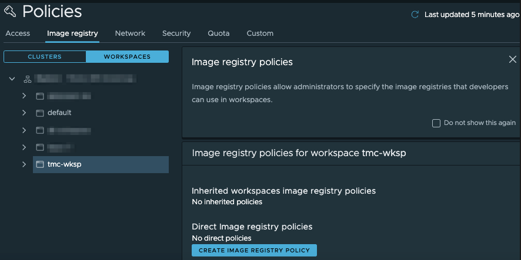
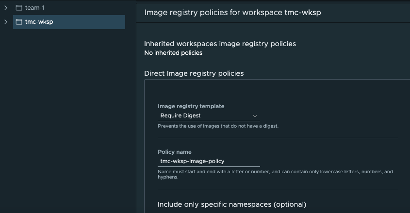
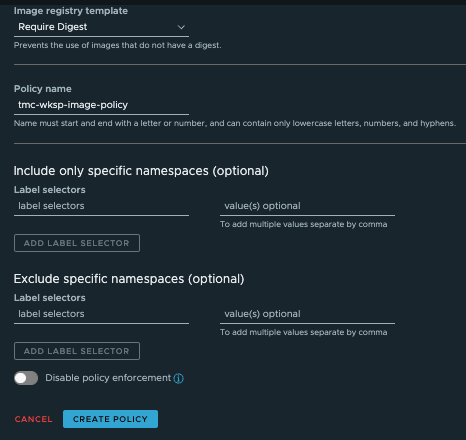
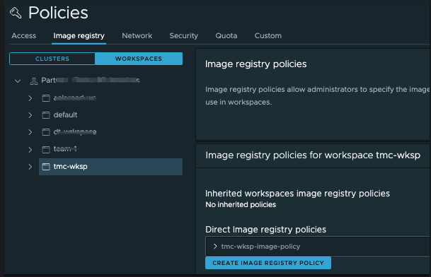

Using VMware Tanzu Mission Control, you can make the deployments to namespaces in your clusters more secure by restricting the image registries from which images can be pulled, as well as the images that can be pulled from a registry. By default, Tanzu Mission Control does not impose any such restriction, and allows you to manage image registry restrictions at the organizational level and at the workspace level.

Tanzu Mission control has Image based policies that can be applied to namespaces within a cluster. These policies can be applied fleet-wide across clusters and clouds by grouping namespaces together in a logical group called Workspaces.

Each namespace and workspace can be protected by an image registry policy that defines the registries from which an image can be pulled, and these policies are inherited down through the organizational hierarchy.

Examples of image registry polices include:

- Implement Policies to not allow images from certain Image Registries
- Policy that prevents container images with no digest from deploying
- Stop container images with latest tag from deploying 
- Blacklist certain images/repos 

**Note:**

Image registry policies cannot be set at a cluster level. To set an image registry policy, select Workspaces under the Image Registry tab in the Policies page.

To create an image registry policy for an object, you must be associated with the **.admin** role for that object

* Click Create Image Registry Policy.
* Select the recipe you want to use.
    * The *`Block latest tag`* recipe prevents the use of images that are tagged latest.
    * The *`Require Digest`* recipe prevents the use of images that do not have a digest.
    * The *`Name-Tag allowlist`* recipe allows you to create rules using an image name or tag name or both.
    * The *`Custom`* recipe allows you to create rules using multiple factors.

As quick example we are going to create a *`Require Digest`* recipe policy using the TMC Console



Select a workspace such as ***tko-day1-ops-ws*** and click Create Image 
Registry Policy. We are going to configure that all the container 
images to be deployed to this workspace must have a container digest. 
Under Image registry template dropdown, select Require Digest:



Give it a name such as `digest-image-policy`{{copy}} and proceed with default values 
for other fields. If needed, you may specify label selectors to 
include or exclude certain namespaces for this policy. 
Finally click Create Policy. 

The steps above show how to create an image registry policy to require digest. Similarly, image 
registry policies to specify a name-tag allowlist, block the latest tag, or even custom policies may be created:
 


Once created, you may edit or delete an image registry policy.

Now let's create a custom policy in workspace ***tko-day1-ops-ws*** that blocks any container image that doesn't have the name `busybox`: 

<details>
<summary><b>TMC Console</b></summary>
<p>

1. Click Workspaces under the Image Registry tab in the Policies page 
and select workspace ***tko-day1-ops-ws***

2. Click Create Image Registry Policy

  

3. Choose Custom in the Image Registry Template field and give it a name 
  such as `{{ session_namespace }}-ip-ui`{{copy}} in the Policy Name field. Under the Rule pane, type in `library/busybox`{{copy}} in the Image Name field. Optionally, you may specify the hostname and port to restrict where the images are pulled from. In addition, you may add more rules by clicking Add Another Rule.

  

4. Optionally, this custom rule may be made to apply to certain namespaces of this workspace if desired by specifying the Label Selectors fields. At the end, click Create Policy.
</p>
</details>

Since image policies can be assigned to a workspace/namespace, let create a new namespace and add it to the workspace **tko-day1-ops-ws**:

```execute-1
tmc cluster namespace create  -n {{ session_namespace }} -k tko-day1-ops-ws -c {{ session_namespace }}-cluster
```

<details>
<summary><b>TMC CLI</b></summary>
<p>

Before we apply this policy using the TMC CLI, let's have a look on its definition

```editor:open-file
file: ~/busybox-image-policy.yaml
```

```editor:select-matching-text
file: ~/busybox-image-policy.yaml
text: "name: (.*)"
isRegex: true
```
<p>
</p>

```editor:replace-text-selection
file: ~/busybox-image-policy.yaml
text: name: {{ session_namespace }}-ip-cli
```

* Create a policy 

    ```execute-1
    tmc workspace image-policy create -f busybox-image-policy.yaml 
    ```
* Confirm that the policy has been created    

    ```execute-1
    tmc workspace image-policy get {{ session_namespace }}-ip-cli  --workspace-name tko-day1-ops-ws 
    ```
</p>
</details>
<p>
</p>

Let's validate that our image registry policy is working by trying to deploy the busybox image to the namespace **{{ session_namespace }}**, 
which is part of the workspace **tko-day1-ops-ws**.

Create a deployment with **nginx** image:

```execute-1
kubectl --kubeconfig=.kube/config create deployment nginx-{{ session_namespace }} --image=nginx -n {{ session_namespace }}
```

Notice the deployment is blocked and won't progress because of the image rules.

```execute-1
kubectl --kubeconfig=.kube/config get events --field-selector type=Warning -n {{ session_namespace }}
```
Delete the deployment
```execute-1
kubectl --kubeconfig=.kube/config delete deployment nginx-{{ session_namespace }} -n {{ session_namespace }}
```

```execute-all
clear
```

Now let's deploy a busybox container to check if the policy will allow it run

```execute-1
kubectl --kubeconfig=.kube/config apply -f busybox-deployment.yaml -n {{ session_namespace }}
```
Confirm that the busybox pod has been deployed

```execute-1
kubectl --kubeconfig=.kube/config get pods -n {{ session_namespace }}
```
Again, check the events if there is any error

```execute-1
kubectl --kubeconfig=.kube/config get events --field-selector type=Warning -n {{ session_namespace }}
```

* Delete the created policy 

    ```execute-1
    tmc workspace image-policy delete {{ session_namespace }}-ip-cli  --workspace-name tko-day1-ops-ws 
    ```

Now, let's create a policy that will allow pulling images from only a particular container registry  
Before we apply this policy using the TMC CLI, let's have a look on its definition

```editor:open-file
file: ~/registry-hotsname-policy.yaml
```

```editor:select-matching-text
file: ~/registry-hotsname-policy.yaml
text: "name: (.*)"
isRegex: true
```
<p>
</p>

```editor:replace-text-selection
file: ~/registry-hotsname-policy.yaml
text: name: {{ session_namespace }}-rp-cli
```

<details>
<summary><b>TMC CLI</b></summary>
<p>

* Create a policy 

    ```execute-1
    tmc workspace image-policy create -f registry-hotsname-policy.yaml
    ```
* Confirm that the policy has been created    

    ```execute-1
    tmc workspace image-policy get {{ session_namespace }}-registry-policy-cli  --workspace-name tko-day1-ops-ws 
    ```
    Create a deployment with **nginx** image from docker hub:

    ```execute-1
    kubectl --kubeconfig=.kube/config create deployment nginx-{{ session_namespace }} --image=nginx -n {{ session_namespace }}
    ```

    Notice the deployment is blocked and won't progress because of the registry rules.

    ```execute-1
    kubectl --kubeconfig=.kube/config get events --field-selector type=Warning -n {{ session_namespace }}
    ```
    Delete the deployment
    ```execute-1
    kubectl --kubeconfig=.kube/config delete deployment nginx-{{ session_namespace }} -n {{ session_namespace }}
    ```

    ```execute-all
    clear
    ```
* Delete the created policy 

    ```execute-1
    tmc workspace image-policy delete {{ session_namespace }}-registry-policy-cli --workspace-name tko-day1-ops-ws
    ```
</p>
</details>


