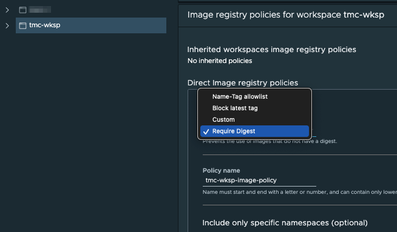

### **Image Registry Policies**

Using VMware Tanzu Mission Control, you can make the deployments to namespaces in your clusters more secure by restricting the image registries from which images can be pulled, as well as the images that can be pulled from a registry. By default, Tanzu Mission Control does not impose any such restriction, and allows you to manage image registry restrictions at the organizational level and at the workspace level.

Tanzu Mission control has Image based policies that can be applied to namespaces within a cluster. These policies can be applied fleet-wide across clusters and clouds by grouping namespaces together in a logical group called Workspaces.

Each namespace and workspace can be protected by an image registry policy that defines the registries from which an image can be pulled, and these policies are inherited down through the organizational hierarchy.

Examples of image registry polices include:

- Implement Policies to not allow images from certain Image Registries
- Policy that prevents container images with no digest from deploying
- Stop container images with latest tag from deploying 
- Blacklist certain images/repos 

Image registry policies cannot be set at a cluster level. To set an image registry policy, select Workspaces under the Image Registry tab in the Policies page.

Select a workspace such as *tmc-wkshp* and click Create Image Registry Policy. We are going to configure that all the container images to be deployed to this workspace must have a message digest. Under Image registry template dropdown, select Require Digest:

Give a name such as *tmc-wksp-image-policy* and proceed with default values for other fields. If needed, you may specify label selectors to include or exclude certain namespaces for this policy. Finally click Create Policy: 

The steps above show how to create an image registry policy to require digest. Similarly, image 
registry policies to specify a name-tag allowlist, block the latest tag, or even custom policies may be created:
 

Once created, you may edit or delete an image registry policy.

Now let us create a custom policy in workspace *tmc-wksh* that blocks any container image that has the name busybox on it: 

1. Click Workspaces under the Image Registry tab in the Policies page 
and select workspace *tmc-wksp*

2. Click Create Image Registry Policy

  

3. Choose Custom in the Image Registry Template field and give it a name 
  such as *tmc-wksp-no-busybox* in the Policy Name field. Under the Rule pane, type in
  *busybox* in the Image Name field. Optionally, you may specify the hostname and port to restrict where the images are pulled from. In addition, you may add more rules by clicking Add Another Rule.

  

4. Optionally, this custom rule may be made to apply to certain namespaces of this 
workspace if desired by specifying the Label Selectors fields. At the end, click Create Policy.

Let us validate that our image registry policy is working by trying to deploy 
the busybox image to the namespace *tmc-ns-01*, which is part of the 
workspace *tmc-wksp*.
